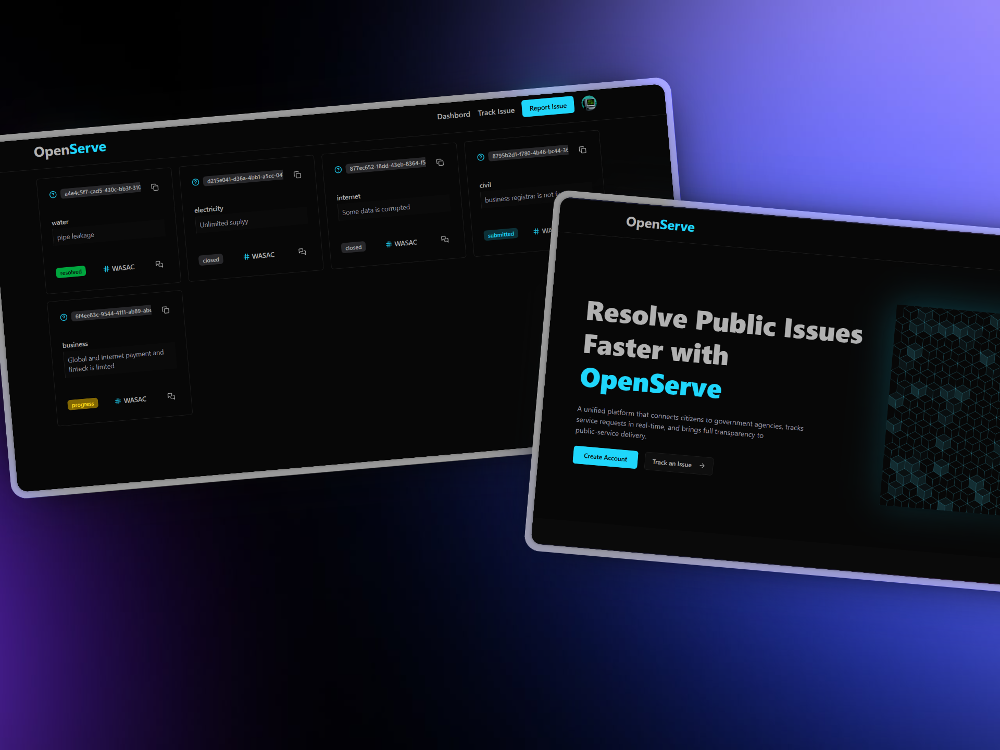

# OpenServe – Citizen Engagement System



## 🖥️ Live Demo

| Environment | URL                               |
| ----------- | --------------------------------- |
| Production  | **https://open-serve.vercel.app** |
| WEB APPLOGO |         |

> _Credentials_: sign in with a Google OR Github account (OAuth).

---

## 📡 Problem & Goal

Public‐service complaints are scattered across phone calls, emails, and social media. Agencies struggle to triage them, and citizens rarely know what happened after they complained. **OpenServe** unifies that flow with a single portal that is:

- **Simple** – one form, smart suggestions.
- **Transparent** – real‑time status updates & dashboards.
- **Extensible** – modular architecture ready for AI‑routing & analytics.

---

## ✨ Key Features (MVP)

| #   | Capability           | Citizen View                                                                               | Agency/Admin View                                      |
| --- | -------------------- | ------------------------------------------------------------------------------------------ | ------------------------------------------------------ |
| 1   | **Submit complaint** | Web form with category + agency autocomplete                                               | —                                                      |
| 2   | **Smart routing**    | —                                                                                          | Ticket lands in the correct agency inbox automatically |
| 3   | **Status tracking**  | Dashboard cards (`submitted → progress → resolved/closed`) + e‑mail / in‑app notifications | Update status, add internal / public notes             |
| 4   | **Auth**             | Google OAuth                                                                               | Google OAuth (agency accounts)                         |
| 5   | **Basic analytics**  | —                                                                                          | Ticket counts, SLA charts (VisX)                       |

_Milestone extras planned_: AI classification, SMS/USSD channel, multi‑language, public analytics.

---

## 🏗 Tech Stack

| Layer            | Tooling                                                  |
| ---------------- | -------------------------------------------------------- |
| **Framework**    | Next.js 14 (App Router, Server Actions, RSC, TypeScript) |
| **Styling / UI** | Tailwind CSS + shadcn/ui (Dark‑mode first)               |
| **Database**     | MongoDB Atlas + Mongoose ODM                             |
| **Auth**         | NextAuth.js (Google & Github Provider)                   |
| **Deployment**   | Vercel (CI/CD, Edge)                                     |

---

## 🚀 Getting Started Locally

```bash
# 1. Clone & install
$ git clone https://github.com/Yves-Developer/open-serve.git
$ cd open-serve && npm install

# 2. Configure environment
$ cp .env.example .env.local
# edit MongoDB + Authjs.dev + Google & Github creds

# 3. Run dev server
$ npm run dev
# ➜ http://localhost:3000
```

### Environment variables (`.env.local`)

```env
# MongoDB
MONGODB_URI=mongodb+srv://<user>:<pass>@cluster.mongodb.net/openserve

# NextAuth
AUTH_SECRET=XXXXXXXXX # Added by `npx auth`. Read more: https://cli.authjs.dev

AUTH_GOOGLE_ID=xxxxxxxxxxxx.apps.googleusercontent.com
AUTH_GOOGLE_SECRET=xxxxxxxxxxxxxxxxxxxx
AUTH_GITHUB_ID=xxxxxxxxxxxx.apps.googleusercontent.com
AUTH_GITHUB_SECRET=xxxxxxxxxxxxxxxxxxxx
NEXTAUTH_URL=http://localhost:3000
```

---

## 🛣 Vision

- [ ] AI‑powered category & agency prediction
- [ ] SMS / USSD submission flow
- [ ] SLA breach alerts
- [ ] Public analytics portal
- [ ] i18n (🇫🇷 🇰🇪 🇷🇼 …)

---

## 🤝 Contributing

1. **Fork & branch** – `git checkout -b feat/my‑feature`
2. **Code style** – run `npm run lint && npm run format`.

---
